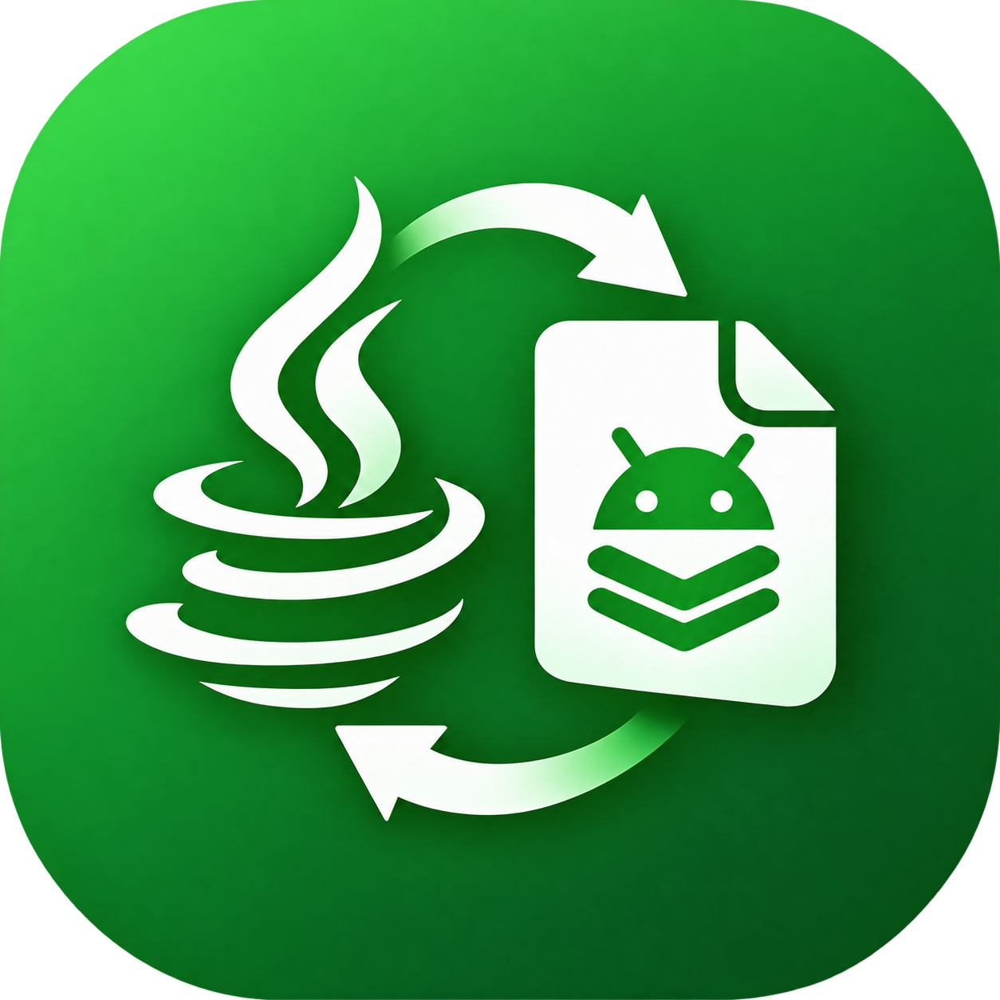

<div align="center">

# ☕ Java2Dex v2.0

**Convert Java to DEX, Write Code, Explore Smali — All On Your Phone.**

*The Ultimate Mobile Toolkit for Android Modders*




**Convert • Compile • IDE • Smali • Mod**

</div>

---

## 🌟 What is Java2Dex?

**Java2Dex** is a complete on-device development toolkit built for **Android modders**.
Write Java code in the built-in **Code IDE**, compile it to **DEX** with one tap,
then explore the result in the **DEX Explorer** — no PC, no Android Studio, 100% offline.

## ⚙️ The Pipeline

```
 Write Code ──▶ [ ECJ Compiler ] ──▶ .class ──▶ [ Google D8 ] ──▶ classes.dex ──▶ [ dexlib2 ] ──▶ Smali ✔
      ▲                                                                          │
      └─────────────────── Code IDE ◀──── DEX Explorer ◀─────────────────────────┘
```

| Stage | Engine | Runs |
|---|---|---|
| Java Editor | Custom Code IDE | On device |
| Compile | Eclipse ECJ 4.6.1 | On device |
| DEX | Google D8 (R8 2.1.75) | On device |
| Disassemble | dexlib2 2.5.2 | On device |

## 🚀 What's New in v2.0

| | Feature |
|---|---|
| 🧠 | **Code IDE** — write, edit & manage code right inside the app |
| 🧬 | **DEX Explorer** — browse classes, read & export smali |
| 🌙 | **Dark / Light Mode** — full theme system |
| 📁 | **Custom Output Folder** — save anywhere you want |
| 🎨 | **New Dashboard** — animated stat cards & quick actions |
| 🔲 | **Redesigned FAB** — square, light radius, soft shadow |
| 👨‍💻 | **Developer Profile** — animated HTML profile in-app |
| ⓘ | **App Info Page** — beautiful animated about screen |

## 🧠 Code IDE Features (15+)

| # | Feature |
|---|---|
| 1 | 📂 **File Explorer Panel** — project tree at a glance |
| 2 | 📄 **New File** — auto-generates class template |
| 3 | 📁 **New Folder** — package structure support (`com/mod/utils`) |
| 4 | 📥 **Import Files** — .java or .zip from storage |
| 5 | 🎨 **Syntax Highlighting** — keywords, strings, comments, numbers |
| 6 | 💾 **Save + Auto-Save** — never lose your code |
| 7 | ↩ **Undo** — one-tap snapshot restore |
| 8 | 🔍 **Find in Code** — jump through matches |
| 9 | **A+ / A-** — adjustable font size (10–28) |
| 10 | 📐 **Word Wrap Toggle** — wrap or horizontal scroll |
| 11 | 📋 **Code Snippets** — class, loop, try-catch, **Xposed hook template** |
| 12 | 📍 **Line : Column indicator** — live caret position |
| 13 | ✏ **Rename / Move** — files and folders |
| 14 | 🗑 **Delete** — files and folders with confirmation |
| 15 | ⚡ **Convert from IDE** — no need to leave the editor |

## 🧬 DEX Explorer Features

| Feature | Description |
|---|---|
| 🏫 **Class Browser** | Every class in the dex, searchable |
| 📜 **Smali Viewer** | Full smali disassembly of any class |
| 📋 **Copy / Share** | Grab smali code instantly |
| 💾 **Save All Smali** | Export entire dex as `.smali` files |
| 🔤 **Strings Tab** | All string constants in the dex |
| 🔍 **Live Filter** | Search classes & strings in real time |

## ⚡ Core Features

| # | Feature |
|---|---|
| 1 | ⚡ One-tap Java → DEX conversion |
| 2 | 📦 ZIP import with auto-extraction |
| 3 | 📚 Library jars on the classpath |
| 4 | 📂 Auto-save to `/storage/emulated/0/Java2Dex/<project>/classes.dex` |
| 5 | ↗ Share the **real .dex file** to any app |
| 6 | ⬇ Export to `Downloads/Java2Dex` |
| 7 | 📄 Full build log with Copy Error |
| 8 | 🔁 Re-convert any project |
| 9 | 📊 Animated dashboard with success/fail stats |
| 10 | 🔍 Instant project search |
| 11 | 🧪 One-tap sample project |
| 12 | 🌙 Dark & light themes |
| 13 | ♻ Reset output folder / wipe all data |
| 14 | 📱 Storage permission flow with friendly UI |
| 15 | 🔒 100% offline — zero telemetry |

## 📱 Installation

1. Go to the [**Actions**](../../actions) tab
2. Open the latest successful **Java2Dex CI** run
3. Download the **Java2Dex-debug-apk** artifact
4. Install *(enable "Install unknown apps" if asked)*
5. Grant **All Files Access** when prompted

## 📂 Output Location

```
/storage/emulated/0/Java2Dex/
└── <project-name>/
    └── classes.dex
```

> 💡 Change the output folder in **Settings → Output Folder**,
> or use **Export** to copy the dex to `Downloads/Java2Dex`.

## 🛠️ Build From Source

```bash
git clone https://github.com/ModderTools/Java2Dex.git
cd Java2Dex
gradle :app:assembleDebug
```

Or just push — **GitHub Actions** builds the APK automatically on every commit.

### Required Assets

| File | Path | Purpose |
|---|---|---|
| `logo.png` | `app/src/main/res/drawable/` | App icon & in-app logo |
| `developer.html` | `app/src/main/assets/` | Developer profile page |
| `android.jar` | auto-bundled by CI | Compile against Android APIs |

## 📸 App Screens

| Screen | Highlights |
|---|---|
| 🏠 Dashboard | Animated stats, quick actions, project cards |
| 🧠 Code IDE | File tree, highlighted editor, 12-tool toolbar |
| 🧬 DEX Explorer | Classes / Strings tabs, smali viewer |
| ⚙ Settings | Theme, font, output folder, data tools |
| ⓘ App Info | Animated hero, tech stack, feature list |

## 🗺️ Roadmap

- [ ] APK packaging from DEX
- [ ] Smali → DEX re-assembly
- [ ] Multi-dex output
- [ ] Code auto-complete
- [ ] Git integration

## 🤝 Contributing

Pull requests are welcome! For major changes, open an issue first
to discuss what you would like to change.

---

<div align="center">

**☕ Java2Dex — Write • Convert • Explore • Mod**

*Made with ❤️ for the modding community*

⭐ **Star this repo if it helped you!**

</div>
